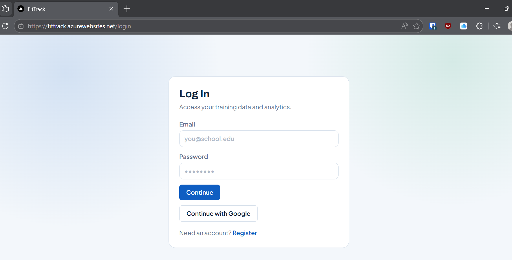
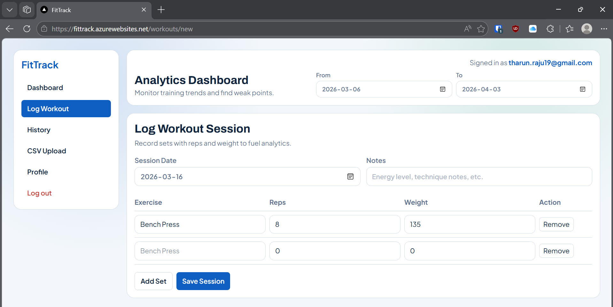
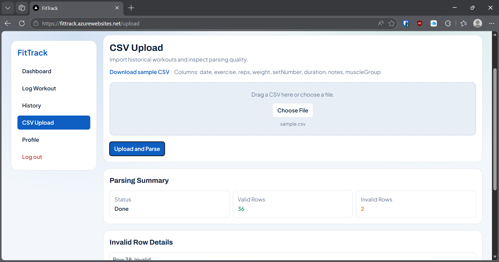
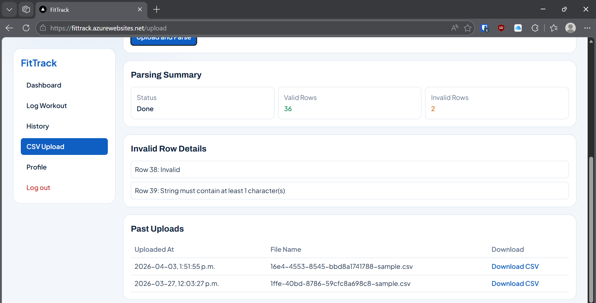
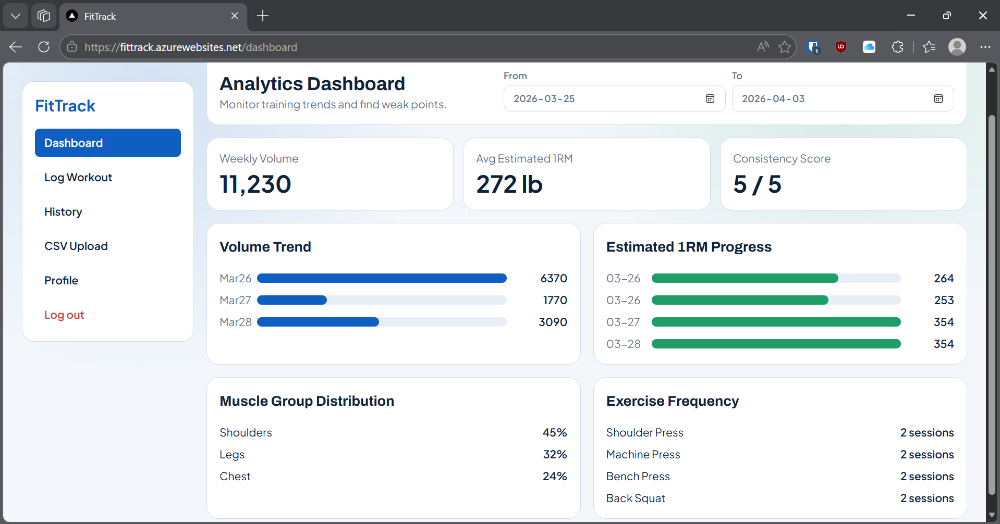

# FitTrack Final Report

## Team Information

| Name | Student Number | Preferred Email |
| --- | --- | --- |
| Tharun Seshachalam | 1010811383 | tharun.seshachalam@mail.utoronto.ca |
| Axel Tang | 1006832144 | axel.tang@mail.utoronto.ca |


## Motivation

Many students and gym-goers track workouts across notes apps, spreadsheets, and screenshots. This creates fragmented data and makes progress tracking difficult. We chose FitTrack to solve this problem with one integrated system that combines secure authentication, workout logging, CSV import, cloud file handling, and analytics in a single full-stack application.

We built it because it combines real workflows with core engineering work—frontend, backend, database, cloud storage, and authentication all in one system.

## Objectives

Our team aimed to:

1. Build a full-stack workout tracking application using the required course technologies.
2. Support both manual workout entry and bulk CSV ingestion.
3. Provide dashboard analytics that reflect persisted user data, not static mock data.
4. Implement secure authentication and route protection for user data.
5. Deploy and validate a realistic end-to-end workflow from login to analytics.

## Technical Stack

### Chosen Architecture

`Next.js Full-Stack`

- Next.js App Router for page routing and full-stack project structure.
- API Routes in `fittrack-web/app/api/**` for backend data handling.
- Server Action in `fittrack-web/app/(app)/workouts/new/actions.ts` for mutation flow.
- Server-side service layer under `fittrack-web/src/server/**`.

### Frontend

- TypeScript (`.ts`/`.tsx`) across all frontend components.
- Next.js + React for UI.
- Tailwind CSS v4 for styling.
- Shared UI patterns via reusable layout/components in `fittrack-web/components/**`.
- Redux Toolkit for advanced client-side shared state.

### Backend and Data

- TypeScript backend logic in API routes and server services.
- Prisma ORM with PostgreSQL (Azure Database for PostgreSQL).
- Better Auth for authentication (email/password + Google OAuth).
- Zod validation for request/payload schema checks.

### Cloud Storage

- Azure Blob Storage via `@azure/storage-blob`.
- CSV files are uploaded/downloaded through backend endpoints and associated with users in database records (`CSVUpload` model).

## Features

### Core Technical Requirements (Implemented)

1. Frontend Requirements
- TypeScript is used for frontend code (`.tsx`/`.ts` files under `app/`, `components/`, `store/`).
- UI is implemented with Next.js (React) using App Router.
- Tailwind CSS is used for styling and reusable UI patterns/components are used across pages.
- Responsive design is implemented with mobile/desktop-aware layouts (grids, adaptive spacing, responsive tables).

2. Data Storage Requirements
- TypeScript is used for backend/server code (`app/api/**`, `src/server/**`).
- PostgreSQL (Azure Database for PostgreSQL) is used as the relational database via Prisma.
- Cloud storage is implemented with Azure Blob Storage for CSV upload/download, with file metadata linked to user records (`CSVUpload`).

3. Architecture Requirement (Option A: Next.js Full-Stack)
- Next.js App Router is used for routing and app structure.
- Server-side logic is implemented through server-side modules and route handling.
- API Routes handle data operations (`/api/auth`, `/api/workouts`, `/api/uploads`, `/api/analytics`, `/api/profile`).
- Server Actions are used for mutations (for example, workout creation in `workouts/new/actions.ts`).

### Advanced Features Implemented

1. User Authentication and Authorization
- User registration/login with email/password.
- Google OAuth integration through Better Auth.
- Session-based authentication with protected routes/APIs and unauthorized request handling.

2. File Handling and Processing
- CSV files are parsed and validated server-side.
- Invalid rows are isolated and reported back to the user with row-level errors.
- Valid rows are transformed into workout sessions/sets and written to PostgreSQL.
- Uploaded files are stored in cloud storage and downloadable through a protected endpoint.

3. Advanced State Management
- Redux Toolkit manages shared global state (`auth`, `dashboard`, `upload`, `workout`).
- Derived dashboard values (for example chart scaling) are computed from fetched data.
- State is synchronized across views (login state, upload parsing summary, dashboard/historical updates).

4. Integration with External Services
- Better Auth + Google OAuth (external identity provider integration).
- Azure Blob Storage integration for cloud file handling.

## Mapping to Course Requirements

| Requirement | How FitTrack Satisfies It |
| --- | --- |
| TypeScript (Frontend) | All frontend pages/components in `.tsx` |
| React/Next.js | Next.js App Router with React components |
| Tailwind CSS | Utility classes across pages/components |
| Responsive Design | Grid/layout adjustments for mobile and desktop views |
| TypeScript (Backend) | API routes and `src/server/**` implemented in TypeScript |
| Relational DB | PostgreSQL with Prisma schema/models |
| Cloud Storage | Azure Blob Storage upload/download for CSV files |
| Next.js Full-Stack | App Router + API routes + server action + service layer |

## User Guide

### 1. Create Account or Sign In

1. Go to `/login`.
2. Choose email/password login or `Continue with Google`.
3. On success, you are redirected to `/dashboard`.



### 2. Log a Workout Session (Manual Entry)

1. Navigate to `/workouts/new`.
2. Set date, optional notes, and add sets (exercise, reps, weight).
3. Click `Save Session`.
4. Success feedback appears; dashboard/history data updates.



### 3. Upload CSV Workouts

1. Navigate to `/upload`.
2. Click `Download sample CSV` to view expected schema.
3. Choose your CSV file and click `Upload and Parse`.
4. Review valid/invalid row counts and invalid row details.



### 4. Download Past Uploads

1. In `/upload`, scroll to `Past Uploads`.
2. Click `Download CSV` for a previously uploaded file.



### 5. Review History and Analytics

1. Go to `/workouts/history` to inspect sessions and apply filters.
2. Go to `/dashboard` to view KPIs and trends.
3. Open `/profile` to view member/date-based account stats.



## Development Guide

### Prerequisites

- Node.js 20+ and npm.
- PostgreSQL database (Azure PostgreSQL recommended).
- Azure Storage account + blob container.
- Google OAuth credentials (if using Google sign-in locally).

### 1. Clone and Install

```bash
git clone https://github.com/AxelTWC/ReactProject.git
cd ReactProject/fittrack-web
npm install
```

### 2. Environment Setup and Configuration

Create a `.env` file in `fittrack-web/` and add the values below.

```env
# Database
DATABASE_URL="postgresql://<user>:<url-encoded-password>@<host>:5432/<database>?schema=public&sslmode=require"

# Better Auth
BETTER_AUTH_SECRET="<long-random-secret-32-plus-characters>"
BETTER_AUTH_URL="http://localhost:3000"

# Google OAuth (required for Google sign-in)
GOOGLE_CLIENT_ID="<google-client-id>"
GOOGLE_CLIENT_SECRET="<google-client-secret>"

# Azure Blob Storage
AZURE_STORAGE_CONNECTION_STRING="<azure-storage-connection-string>"
AZURE_STORAGE_CONTAINER_NAME="fittrack-uploads"
```

Important notes:

1. URL-encode special characters in the database password (`@`, `#`, `%`, `/`, `:`).
2. For deployment, set `BETTER_AUTH_URL` to your live domain. Example - "https://fittrack.azurewebsites.net/"

### 3. Database Initialization

```bash
npm run db:generate
npm run db:push
```

This generates Prisma client and applies schema to the configured PostgreSQL database.

### 4. Cloud Storage Configuration

1. Create an Azure Storage account.
2. Create a blob container (example: `fittrack-uploads`).
3. Set `AZURE_STORAGE_CONNECTION_STRING` and `AZURE_STORAGE_CONTAINER_NAME` in `.env`.
4. Verify by uploading a CSV through `/upload` and downloading it from `Past Uploads`.

### 5. Local Development and Testing

Run dev server:

```bash
npm run dev
```

Build check:

```bash
npm run build
```


Manual verification checklist:

1. Register/login flow works (email/password and Google OAuth).
2. Protected routes redirect when unauthenticated.
3. Manual workout logging persists and appears in history/dashboard.
4. CSV upload parsing summary returns valid/invalid rows.
5. Uploaded files are downloadable from cloud-backed endpoint.

### 6. Credentials Submission Statement

Credentials sent to TA: The whole .env file has been sent to TA.

## Deployment Information

### Platform
- Deployment platform: Azure App Service
- Live URL: https://fittrack.azurewebsites.net/

### Prerequisites
- Azure CLI installed and authenticated (`az login`).
- Azure App Service resource created (resource group: `ece1724-web-rg`, app name: `fittrack`).
- Environment variables configured in App Service application settings (via Azure portal or `az webapp config appsettings set`).

### Deployment Steps

From the `fittrack-web/` directory:

1. **Remove previous build artifacts**:
   ```bash
   rm -f app.zip
   ```

2. **Create deployment package** (excludes node_modules, .next cache, .git, and .env files):
   ```bash
   zip -r app.zip . -x "node_modules/*" ".next/*" ".git/*" ".env*"
   ```

3. **Deploy to Azure App Service**:
   ```bash
   az webapp deployment source config-zip --resource-group ece1724-web-rg --name fittrack --src app.zip
   ```

After deployment, verify the live application at https://fittrack.azurewebsites.net/

## Video Demo

- Demo URL : https://youtu.be/S4qNV0fJfNQ


## AI Assistance & Verification (Summary)

We used AI as a development assistant for architecture questions, debugging, and writing initial drafts. We didn't trust everything it suggested—we tested all changes against actual runtime behavior and build results.

Where AI actually helped:

1. Diagnosing CSV import transaction failures and proposing batch-write strategy.
2. Reviewing auth migration path to Better Auth with Google OAuth.
3. Identifying cache and state consistency issues between protected views.
4. Drafting report structure and technical communication.

Representative AI limitation:

- One suggested implementation path required adaptation for this codebase and deployment constraints (see `ai-session.md` for concrete examples and corrections).

How correctness was verified:

1. End-to-end manual user-flow testing (login, create workout, upload CSV, view analytics).
2. Build validation (`npm run build`) and lint checks.
3. Runtime API response checks and parsing/validation result inspection.

For concrete examples (prompt, response, correction, verification), see `ai-session.md`.

## Individual Contributions

### Tharun Seshachalam

- Took the lead on backend architecture and integration work.
- Implemented most server-side features, including authentication/session flow, API behavior, CSV processing pipeline, and database-side reliability fixes.
- Handled deployment setup and environment configuration, then coordinated end-to-end checks to ensure production behavior matched local testing.

### Axel Tang

- Led most of the frontend implementation across the app pages and user flows.
- Built and refined the user-facing experience (navigation, forms, dashboards, history/upload/profile views), with emphasis on responsiveness and usability.
- Supported integration testing and UI-level bug fixes to make sure backend changes were reflected cleanly in the interface.

Both team members collaborated on testing, feature validation, and final documentation polish.

## Source Code Organization

Top-level structure:

- `fittrack-web/app/` - App Router pages, layouts, API routes.
- `fittrack-web/components/` - Reusable UI and layout components.
- `fittrack-web/src/server/` - Service layer, route handlers, validators, middleware, DB utilities.
- `fittrack-web/store/` - Redux Toolkit store and slices.
- `fittrack-web/prisma/` - Prisma schema.
- `fittrack-web/public/` - static assets and sample CSV template.

Repository includes:

1. Application source files for frontend and backend.
2. Database schema definition (`prisma/schema.prisma`).
3. Environment variable documentation in this README (Development Guide).
4. `.gitignore` excluding build output, dependencies, and `.env*`.
5. API endpoint documentation summary (below).


## API Endpoints (Essential Documentation)

Primary app routes:

- `POST /api/auth/[...all]` - Better Auth handlers.
- `GET /api/auth/me` - current auth/session info.
- `GET /api/analytics/summary` - dashboard KPIs/charts.
- `GET /api/workouts` - workout history list with filters.
- `POST /api/workouts` - workout creation endpoint (if used).
- `GET /api/uploads` - list user uploads.
- `POST /api/uploads/csv` - upload and parse CSV.
- `GET /api/uploads/download/[fileKey]` - secure CSV download.
- `GET /api/profile/stats` - member since, last login, total workouts.

## Lessons Learned and Concluding Remarks

This project reinforced that reliable full-stack systems need careful coordination between frontend UX, backend validation, database modeling, and cloud infrastructure. The most important lessons were:

1. Data integrity and batching strategies matter for production-like workloads (especially in cloud-hosted DB environments).
2. Security and session flow should be first-class concerns, not last-minute additions.
3. Clear state boundaries (local vs shared vs persisted) improve maintainability and reduce UI inconsistency.
4. Documentation quality directly affects reproducibility and grading outcomes.

FitTrack is functionally complete for the core requirements and includes multiple advanced features, including authentication/authorization, advanced state management, and CSV file handling/processing with cloud storage integration. The system is integrated end-to-end, validated through manual user-flow testing and build checks, and ready for final submission.